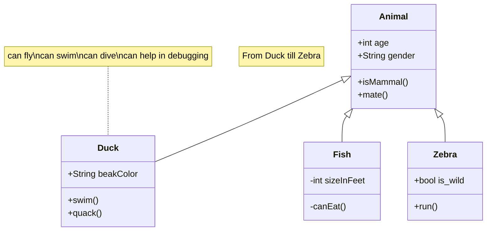
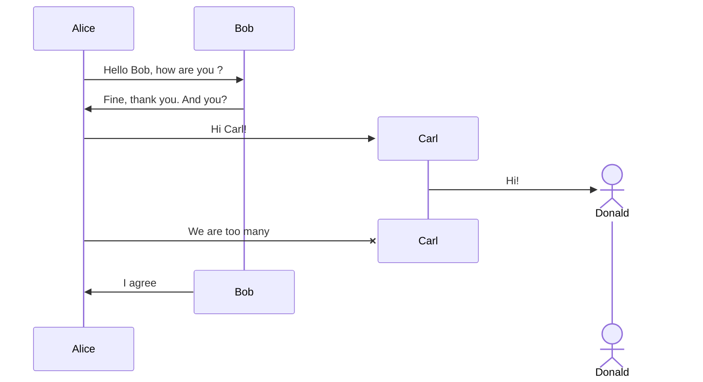

# Diagrams

!!! note

    Это только примеры диаграмм. Они не имеют ни чего общего с действительностью.

Backstage TechDocs поддерживает mkdocs-material, поэтому здесь работает большинство его фишек, включая [диаграммы](https://squidfunk.github.io/mkdocs-material/reference/diagrams/).

## Class

## Sequence

